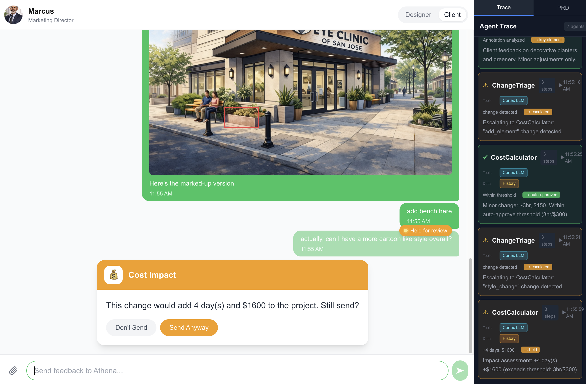

# Workflow Guardrail

**AI-powered scope protection for freelance design projects**

> Built for the Llama Lounge Agentic Hackathon, Feb 27-28, 2026


## The Problem

Scope creep costs freelancers up to [**£8,000/year**](https://underpinned.com/scope-creep-what-is-it-and-how-can-freelancers-prevent-it/) (~$10,000 USD). Clients request "small changes" that balloon into major revisions. Designers either:
- Do free work to maintain relationships
- Have awkward money conversations that damage trust

## The Solution

Workflow Guardrail intercepts messages between designers and clients, using AI agents to catch scope-changing requests before they're sent.


*CostCalculator holds a $1600 change request for client confirmation*

**Agents:**

1. **ScopeWatcher** - Validates design deliverables against the PRD using Snowflake Cortex Vision
2. **CostCalculator** - Estimates impact of change requests using historical edit data from Snowflake
3. **ChangeTriage** - Classifies client messages (trivial vs. scope-changing) using Cortex LLM
4. **ScopeScribe** - Records client decisions as binding scope items

## Tech Stack

| Component | Technology |
|-----------|------------|
| **LLM Inference** | Snowflake Cortex (Claude Sonnet 4.5) |
| **Vision Analysis** | Snowflake Cortex Vision |
| **Historical Data** | Snowflake Table (`EDIT_HISTORY`) |
| | Composio --> Google Drive (disabled right now)|
| **Frontend** | Next.js 14, React, Tailwind CSS |
| **Image Annotation** | Konva.js |

## Demo Flow

1. **Designer uploads image** → Cortex Vision detects objects → ScopeWatcher validates against PRD
2. **Client requests change** → Cortex LLM classifies request → CostCalculator queries 100 historical edits → Shows impact estimate
3. **Client confirms** → PRD updated with budget amendment

## Quick Start

```bash
# Install dependencies
pnpm install

# Set up environment
cp .env.example .env.local
# Add your Snowflake credentials

# Run development server
pnpm dev
```

Open [http://localhost:3000](http://localhost:3000)

## Environment Variables

```env
SNOWFLAKE_ACCOUNT=your_account
SNOWFLAKE_USER=your_user
SNOWFLAKE_PASSWORD=your_password
SNOWFLAKE_WAREHOUSE=COMPUTE_WH
SNOWFLAKE_DATABASE=POLICY_DB
SNOWFLAKE_SCHEMA=DESIGN_PROJECTS
```

## Snowflake Setup

The app queries `POLICY_DB.DESIGN_PROJECTS.EDIT_HISTORY` for historical edit data. See `scripts/setup-snowflake-tables.sql` for table schema.

## Architecture

```
Client Message
     │
     ▼
┌─────────────┐
│ ChangeTriage │ ──► Cortex LLM (classify request)
└─────────────┘
     │
     ▼ (if non-trivial)
┌──────────────┐
│CostCalculator│ ──► Snowflake Table (100 historical edits)
└──────────────┘     ──► Cortex LLM (estimate impact)
     │
     ▼
┌─────────────┐
│ Validation  │ ──► Show impact, get confirmation
└─────────────┘
     │
     ▼
┌─────────────┐
│  PRD-Sync   │ ──► Update project record
└─────────────┘
```

## Team

Built by Uma Kelkar at the Llama Lounge Agentic Hackathon
Dates: Feb 27-28, 2026 (16 hours total: Fri 12pm-8pm, Sat 9am-5pm)

## License

MIT
